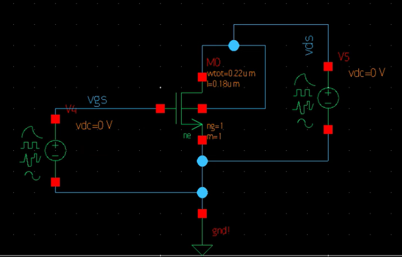
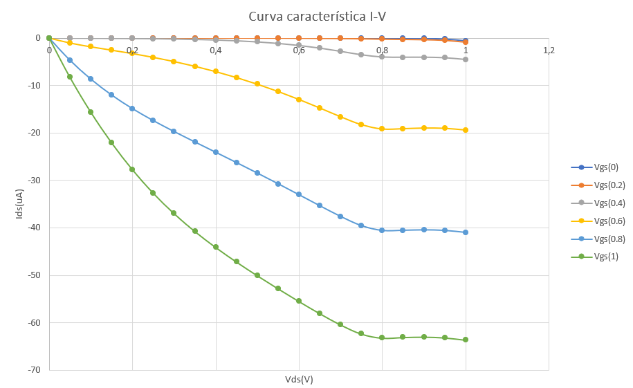
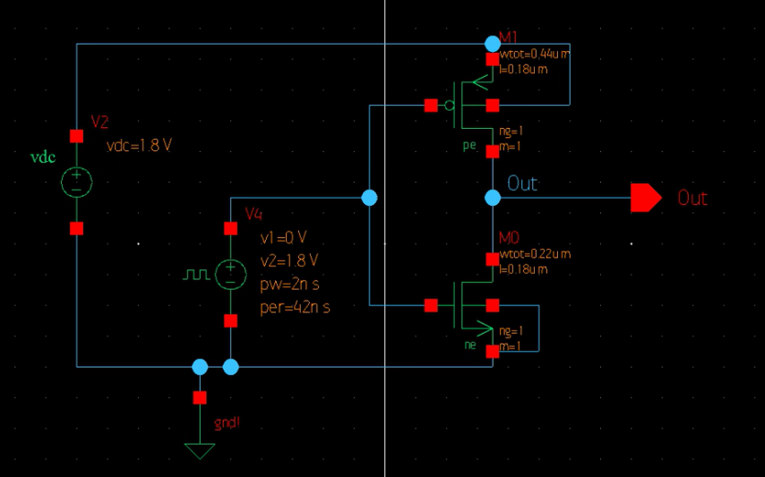
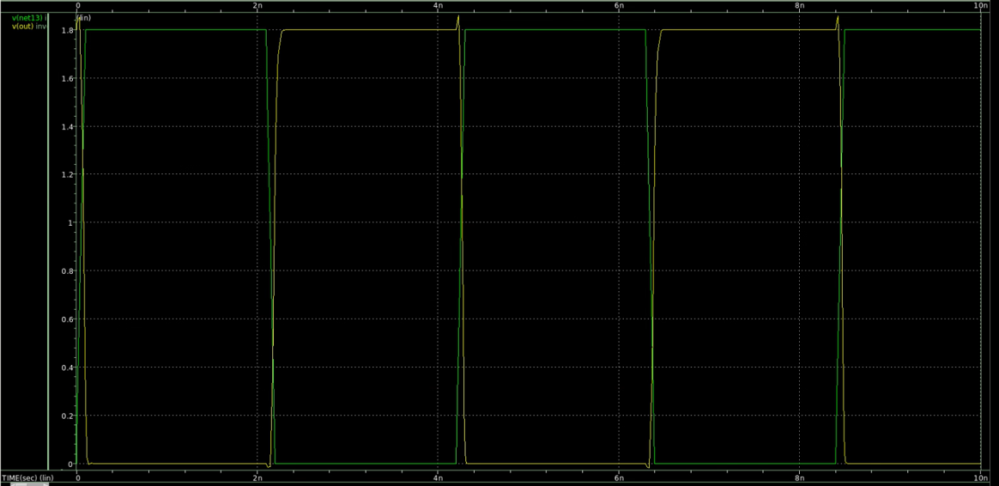
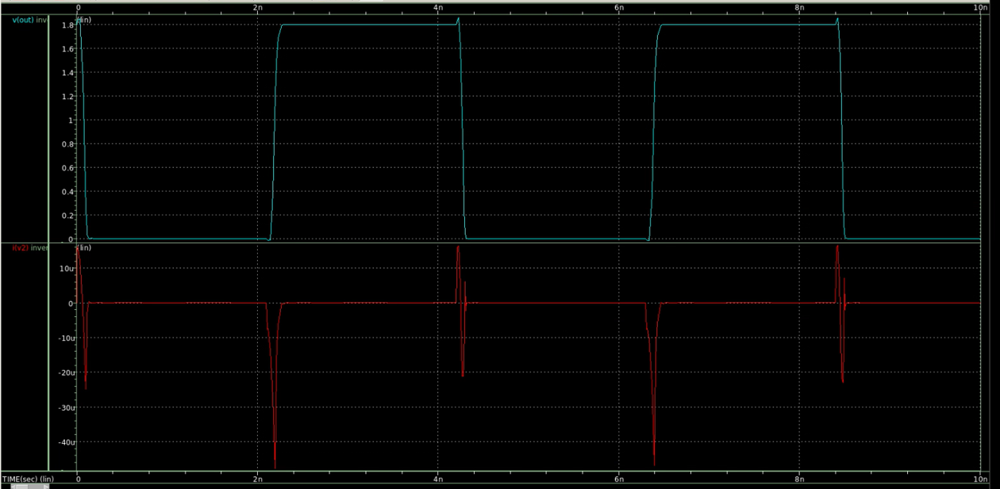
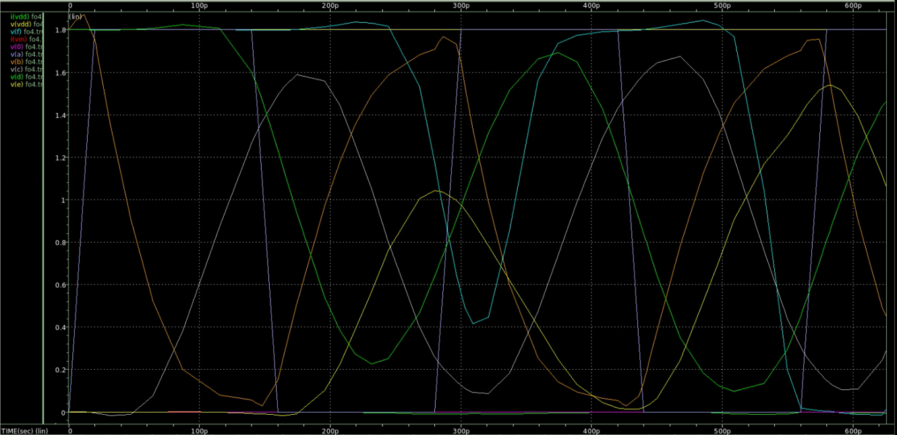
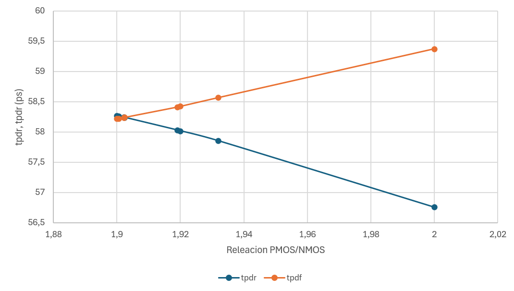
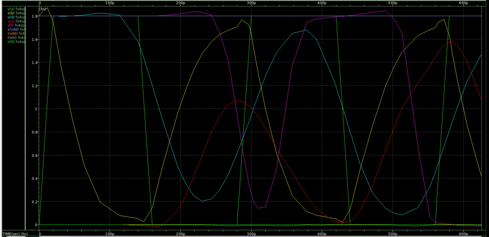

# Tarea1_vlsi
## Parte 1

Para la obtención de la resistencia efectiva de los transistores a utilizar se utiliza la siguiente formula:

$$R = \frac{V_{DD}}{I_H + I_L}$$

En este caso $I_H$ es aproximada a la corriente de saturación e $I_L$ a la corriente de corte, por lo que la ecuación queda:
$$R_n = \frac{1.8V}{(475\mu A + 3pA)/\mu m} = 3789\Omega$$ 
$$R_p = \frac{1.8V}{(170\mu A + 3pA)/\mu m} = 10588.24\Omega $$

Luego se procede con la obtención de la capacitancia de compuerta. Para ello, se utilizó la siguiente formula:
$$C = \frac{2}{3}W*L*C_{ox}+W*C_{ov}$$
$$C_n=0.487fF$$
$$C_p=0.8152fF$$
Por último se obtiene la constante $RC$ para el proceso. Lo cual se ve de la siguiente manera:
$$RC_n=3.789k\Omega *0.487fF = 1.845*10^{-12}$$
$$RC_p=10.588k\Omega *0.8152fF = 8.631*10^{-12}$$

## Parte 2
Para el diseño de un inversor de tamaño mínimo con margen de ruido simetríco se requiere de que $\beta_p=\beta_n$ que se logra obtener al mantener una relación PMOS/NMOS de $2/1$ del ancho del transistor. Las dimensiones de los transistores serían los siguientes:

|  Dimensión  |  NMOS  |  PMOS  |
|  :---  |  ---:  |  :---:  | 
|  W |  220 nm  |  440 nm  | 
|  L  |  180 nm  |  180 nm  | 

Siguiendo las reglas de escalabilidad y tomando $\lambda=25n$ se tiene las siguientes razones:
$$\frac{W_n}{L_n}=\frac{8.8}{7.2}\lambda$$
$$\frac{W_p}{L_p}=\frac{17.6}{7.2}\lambda$$

Para obtener el voltaje de umbral del inversor se debe tomar en cuenta la relación $\beta_p/\beta_n=r$. En este caso la relación $r$.  Al observar la curva característica, se observa que los transistores van a estar en la zona de saturación para transistores canal largo. Por lo que la ecuación se vería de la siguiente manera:
$$V_{inv}=\frac{V_{DD}+V_{tp}+V_{tn}\sqrt{\frac{1}{r}}}{1+\sqrt{\frac{1}{r}}}$$
$$V_{inv}=\frac{1.8-0.6+0.45}{2}=0.825V$$


## Resultados de las simulaciones
### NMOS - Curva característica
Para las curvas características del NMOS se genera el diagrama de la siguente manera ([esquematico](nmos/schematic/)):



Para poder variar los valores de las fuentes v4 y v5 se utiliza el siguiente código:
```sp
* nmos.sp

.temp 25
.lib '/mnt/vol_NFS_rh003/Est_VLSI_I_2024/Faerron_Duran_I_2024_vlsi/tutorial/Hspice/lp5mos/xt018.lib' tm
.lib '/mnt/vol_NFS_rh003/Est_VLSI_I_2024/Faerron_Duran_I_2024_vlsi/tutorial/Hspice/lp5mos/param.lib' 3s
.lib '/mnt/vol_NFS_rh003/Est_VLSI_I_2024/Faerron_Duran_I_2024_vlsi/tutorial/Hspice/lp5mos/config.lib' default


.global gnd
.option post
********************************************************************************
* Library          : basic_cells
* Cell             : nmos
* View             : schematic
* View Search List : hspice hspiceD schematic cmos_sh spice veriloga
* View Stop List   : hspice hspiceD
********************************************************************************
xm0 vds vgs gnd vds ne w=220n l=180n
v5 vds gnd 0
v4 vgs gnd 0

*----------------------------------------------------------------------
* Stimulus
*----------------------------------------------------------------------
.dc v5 0 1.0 0.05 SWEEP v4 0 1.0 0.2
.print v(vds) v(vgs) i(v5)
.probe v(vds) v(vgs)

.end
```
Una vez con la simulación se obtienen los datos para la curva característica, la cual se muestra en la siguiente figura ([datos](nmos/graficas.xlsx)):



## Inversor
El esquemático utilizado para el inversor se muestra en la siguiente figura ([esquematico](inversor/schematic/)):



Para simular el voltaje de salida y entrada se utliza el siguiente código ([script](inversor/tarea/inversorCompleto/inversor_test.sp)):
```
*  inversor_test.sp

.temp 25
.lib '/mnt/vol_NFS_rh003/Est_VLSI_I_2024/Faerron_Duran_I_2024_vlsi/tutorial/Hspice/lp5mos/xt018.lib' tm
.lib '/mnt/vol_NFS_rh003/Est_VLSI_I_2024/Faerron_Duran_I_2024_vlsi/tutorial/Hspice/lp5mos/param.lib' 3s
.lib '/mnt/vol_NFS_rh003/Est_VLSI_I_2024/Faerron_Duran_I_2024_vlsi/tutorial/Hspice/lp5mos/config.lib' default

.global gnd
.option post
********************************************************************************
* Library          : basic_cells
* Cell             : inversor
* View             : schematic
* View Search List : hspice hspiceD schematic cmos_sch spice veriloga
* View Stop List   : hspice hspiceD
********************************************************************************
xm0 out net13 gnd gnd ne w=220n l=180n as=1.056e-13 ad=1.056e-13 ps=1.4e-06 pd=1.4e-06
+ nrs=1.22727 nrd=1.22727 m='1*1' par1='1*1' xf_subext=0
xm1 out net13 net9 net9 pe w=440n l=180n as=2.112e-13 ad=2.112e-13 ps=1.84e-06
+ pd=1.84e-06 nrs=0.613636 nrd=0.613636 m='1*1' par1='1*1' xf_subext=0
v2 net9 gnd dc=1.8
v7 net13 gnd dc=0 pulse ( 0 1.8 0 100p 100p 2n 4.2n )


*--------------------------------------------------------------
* Stimulus
*--------------------------------------------------------------
.tran 10p 10n
.probe v(out) v(net13)
.print v(out) v(net13)

.end
```
Este código da como resultado gráficamente el voltaje de salida (V(out)) y entrada (V(net13)) como se muestra en la siguiente figura:



Y también se puede obtener las gráficas con el valor de la corriente Ids(i(v2)) y la tensión de salida v(out) como se muestra en la siguiente:



## Fanout of 4 (Fo4) - Inversor
Para esta sección se utiliza el siguiente código para crear subcircuitos del inversor ([script](inversor/tarea/fo4/H=4/fo4.sp)):
```
* fo4.sp
*----------------------------------------------------------------------
* Parameters and models
*----------------------------------------------------------------------
.param SUPPLY=1.8
.lib '/mnt/vol_NFS_rh003/Est_VLSI_I_2024/Faerron_Duran_I_2024_vlsi/tutorial/Hspice/lp5mos/xt018.lib' tm
.lib '/mnt/vol_NFS_rh003/Est_VLSI_I_2024/Faerron_Duran_I_2024_vlsi/tutorial/Hspice/lp5mos/param.lib' 3s
.lib '/mnt/vol_NFS_rh003/Est_VLSI_I_2024/Faerron_Duran_I_2024_vlsi/tutorial/Hspice/lp5mos/config.lib' default
.param H=4
.option scale=25n
.temp 70
.option post
*----------------------------------------------------------------------
* Subcircuits
*----------------------------------------------------------------------
.global vdd gnd
.subckt inv a y N=8.8 P=17.6
xm0 y a gnd gnd ne W='N' L=7.2
+ AS='N*5' PS='2*N+10' AD='N*5' PD='2*N+10'
xm1 y a vdd vdd pe W='P' L=7.2
+ AS='P*5' PS='2*P+10' AD='P*5' PD='2*P+10'
.ends
*----------------------------------------------------------------------
* Simulation netlist
*----------------------------------------------------------------------
Vdd vdd gnd 'SUPPLY'
Vin a gnd PULSE 0 'SUPPLY'  0ps 20ps 20ps 120ps 280ps
X1 a b inv * shape input waveform
X2 b c inv M='H' * reshape input waveform
X3 c d inv M='H**2' * device under test
X4 d e inv M='H**3' * load
X5 e f inv M='H**4' * load on load
*----------------------------------------------------------------------
* Stimulus
*----------------------------------------------------------------------
.tran 10p 10n
.measure tpdr * rising prop delay
+ TRIG v(c) VAL='SUPPLY/2' FALL=1
+ TARG v(d) VAL='SUPPLY/2' RISE=1
.measure tpdf * falling prop delay
+ TRIG v(c) VAL='SUPPLY/2' RISE=1
+ TARG v(d) VAL='SUPPLY/2' FALL=1
.measure tpd param='(tpdr+tpdf)/2' * average prop delay
.measure trise * rise time
+ TRIG v(d) VAL='0.2*SUPPLY' RISE=1
+ TARG v(d) VAL='0.8*SUPPLY' RISE=1
.measure tfall * fall time
+ TRIG v(d) VAL='0.8*SUPPLY' FALL=1
+ TARG v(d) VAL='0.2*SUPPLY' FALL=1
.end
```
Con estos subcircuitos se obtiene la siguiente gráfica de Fo4 del inversor:



De esta gráfica se obtienen los valores de tpdr, tpdf, tpd, trise, tfall, también junto con los valores de TRIG y TARG los cuáles indican los eventos de activación y objetivo entre los cuales se mide el retraso. Los cuales se muestran en la siguiente tabla:
|Parámetro|Tiempo(ps)|Targ|Trig|
|---|---|---|---|
|tpdr|56.7592|296.1991|239.4399|
|tpdf|59.3732|176.5518|117.1786|
|tpd|58.0662|||
|trise|74.8842|331.3362|256.4520|
|tfall|60.8461|210.2863|149.4412|

## Fo4 - variación manual de PMOS

Los datos que se hicieron manualmente se encuentran en la siguiente tabla ([datos](imagenes/tiempos/)):
|PMOS(nm)|PMOS/NMOS|tpdr(ps)|tpdf(ps)|diferencia = tpdr-tpdf [ps]|
|-------|------|-------|--------|-------|
|418,0000|1,9000|58,2700|58,2194|0,05060|
|418,1250|1,9005|58,2633|58,2249|0,03840|
|418,4750|1,9021|58,2443|58,2403|0,00400|
|418,4975|1,9022|58,2431|58,2413|0,00180|
|418,5250|1,9023|58,2416|58,2425|-0,0009|
|422.1800|1,9190|58,0323|58,4131|-0,3808|
|422.4000|1,9200|58,0190|58,4252|-0,4062|
|425,0000|1,9318|57,8570|58,5676|-0,7106|
|440,0000|2,0000|56,7592|59,3732|-2,6140|

La gráfica de la relación PMOS/NMOS con tpdr, tpdf se muestra en la siguiente imagen ([excel](inversor/tarea/fo4%20(variacion%20manual))):


En base a los resultados obtenidos de las variaciones manuales, el valor que más se aproxima a una diferencia de tpdr-tpdf igual a 0, es el que tiene el tamaño de PMOS de 418,525n con una relación de PMOS/NMOS igual a 1.9023, ya que su valor de tpdr-tpdf = -0.0009ps o mejor dicho -900a, en donde en la gráfica se observa donde se cruzan las dos lineas con un promedio de tiempo de **58.24205ps**.

## Fo4 optimizado - Inversor
Para obtener la optimización del Fo4 se utiliza el siguiente código ([script](inversor/tarea/fo4opt/H=4/fo4opt.sp)):
```
* fo4opt.sp
*----------------------------------------------------------------------
* Parameters and models
*----------------------------------------------------------------------
.param SUPPLY=1.8
.option scale=25n
.lib '/mnt/vol_NFS_rh003/Est_VLSI_I_2024/Faerron_Duran_I_2024_vlsi/tutorial/Hspice/lp5mos/xt018.lib' tm
.lib '/mnt/vol_NFS_rh003/Est_VLSI_I_2024/Faerron_Duran_I_2024_vlsi/tutorial/Hspice/lp5mos/param.lib' 3s
.lib '/mnt/vol_NFS_rh003/Est_VLSI_I_2024/Faerron_Duran_I_2024_vlsi/tutorial/Hspice/lp5mos/config.lib' default
.temp 70
.option post
*----------------------------------------------------------------------
* Subcircuits
*----------------------------------------------------------------------
.global vdd gnd
.subckt inv a y N=8.8 P=17.6
xm0 y a gnd gnd ne W='N' L=7.2
+ AS='N*5' PS='2*N+10' AD='N*5' PD='2*N+10'
xm1 y a vdd vdd pe W='P' L=7.2
+ AS='P*5' PS='2*P+10' AD='P*5' PD='2*P+10'
.ends
*----------------------------------------------------------------------
* Simulation netlist
*----------------------------------------------------------------------
Vdd vdd gnd 'SUPPLY'
Vin a gnd PULSE 0 'SUPPLY' 0ps 20ps 20ps 120ps 280ps
X1 a b inv P='P1' * shape input waveform
X2 b c inv P='P1' M=4 * reshape input waveform
X3 c d inv P='P1' M=16 * device under test
X4 d e inv P='P1' M=64 * load
X5 e f inv P='P1' M=256 * load on load
*----------------------------------------------------------------------
* Optimization setup
*----------------------------------------------------------------------
.param P1=optrange(17.6,8.8,35.2) * search from 8.8 to 35.2, guess 17.6
.model optmod opt itropt=30 * maximum of 30 iterations
.measure bestratio param='P1/4' * compute best P/N ratio
*----------------------------------------------------------------------
* Stimulus
*----------------------------------------------------------------------
.tran 10p 10n SWEEP OPTIMIZE=optrange RESULTS=diff MODEL=optmod
.measure tpdr * rising propagation delay
+ TRIG v(c) VAL='SUPPLY/2' FALL=1 
+ TARG v(d) VAL='SUPPLY/2' RISE=1
.measure tpdf * falling propagation delay
+ TRIG v(c) VAL='SUPPLY/2' RISE=1
+ TARG v(d) VAL='SUPPLY/2' FALL=1 
.measure tpd param='(tpdr+tpdf)/2' goal=0 * average prop delay
.measure diff param='tpdr-tpdf' goal = 0 * diff between delays
.end
```
Con el código anterior se obtiene la siguiente gráfica:



Y en base a estos resultados también se obtienen los siguientes valores ya optimizados con el PMOS = 423.49nm.
|Parámetro|Tiempo(ps)|Targ|Trig|
|---|---|---|---|
|tpdr|57.9524|297.3057|239.3533|
|tpdf|58.4849|174.5592|116.0743|
|tpd|58.2187|||

Esto indica una diferencia de tpdr-tpdf de -532.5770fs, si la meta es de 0, el valor es bastante aproximado.

## Comparación de simulación y cálculos

Se puede calcular la diferencia de los tiempos de propagación para diferentes fanouts mantienendo la relación $P/N = 2/1$ y siguiendo la formula para los valores de $h=3$ y $h=4$:

$$\Delta t_{pdr}= \frac{3}{2}R_pC = 2.7675*10^{-12}s$$
$$\Delta t_{pdf}=3R_nC=25.893*10^{-12}s$$
