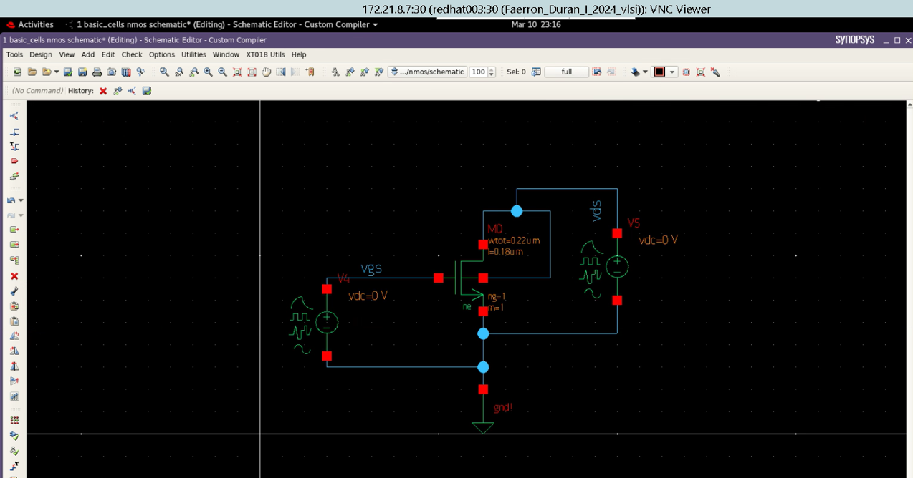

# Tarea1_vlsi
## Parte 1
## Solución
### NMOS
Para las curvas características del NMOS se genera el diagrama de la siguente manera:


Para poder variar los valores de las fuentes v4 y v5 se utiliza el siguiente código:
```sp
* nmos.sp

.temp 25
.lib '/mnt/vol_NFS_rh003/Est_VLSI_I_2024/Faerron_Duran_I_2024_vlsi/tutorial/Hspice/lp5mos/xt018.lib' tm
.lib '/mnt/vol_NFS_rh003/Est_VLSI_I_2024/Faerron_Duran_I_2024_vlsi/tutorial/Hspice/lp5mos/param.lib' 3s
.lib '/mnt/vol_NFS_rh003/Est_VLSI_I_2024/Faerron_Duran_I_2024_vlsi/tutorial/Hspice/lp5mos/config.lib' default


.global gnd
.option post
********************************************************************************
* Library          : basic_cells
* Cell             : nmos
* View             : schematic
* View Search List : hspice hspiceD schematic cmos_sh spice veriloga
* View Stop List   : hspice hspiceD
********************************************************************************
xm0 vds vgs gnd vds ne w=220n l=180n
v5 vds gnd 0
v4 vgs gnd 0

*----------------------------------------------------------------------
* Stimulus
*----------------------------------------------------------------------
.dc v5 0 1.0 0.05 SWEEP v4 0 1.0 0.2
.print v(vds) v(vgs) i(v5)
.probe v(vds) v(vgs)

.end
```