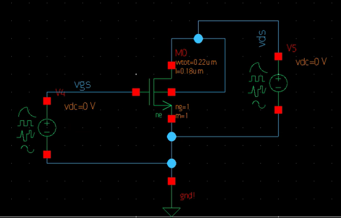
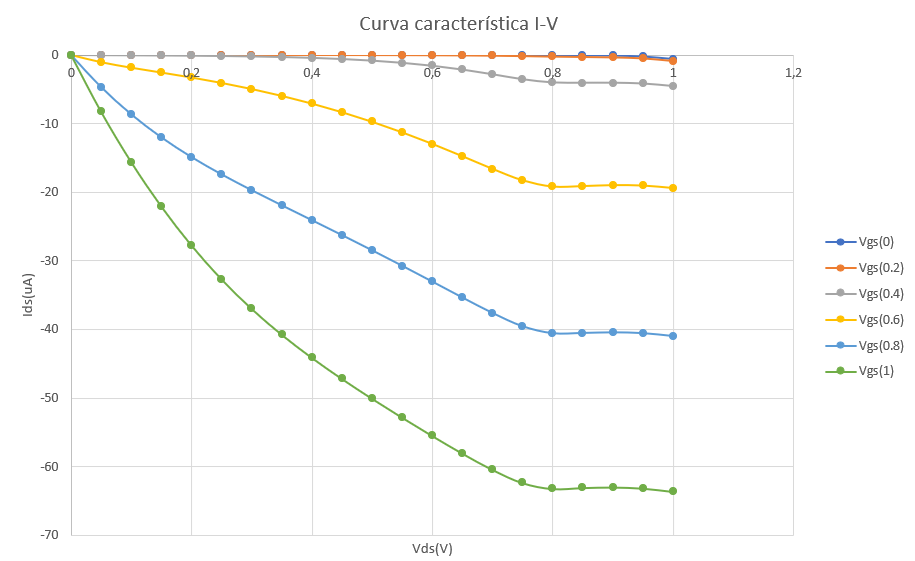
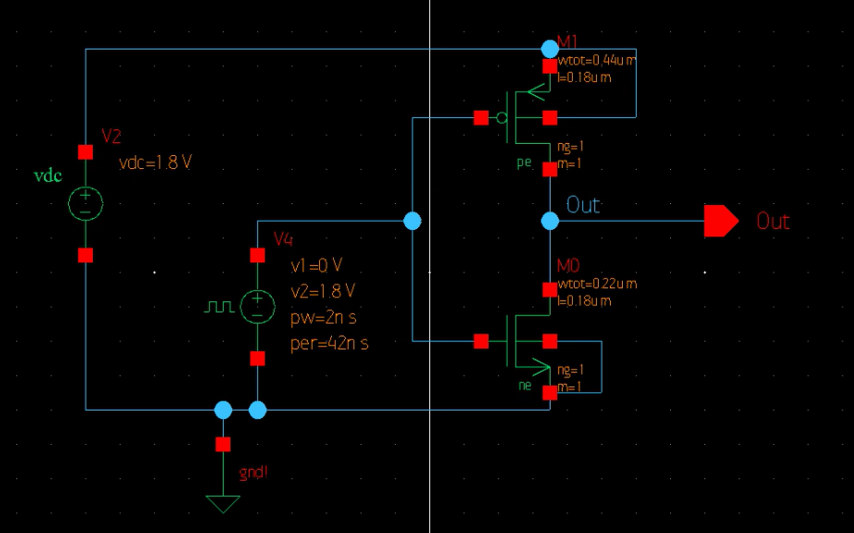
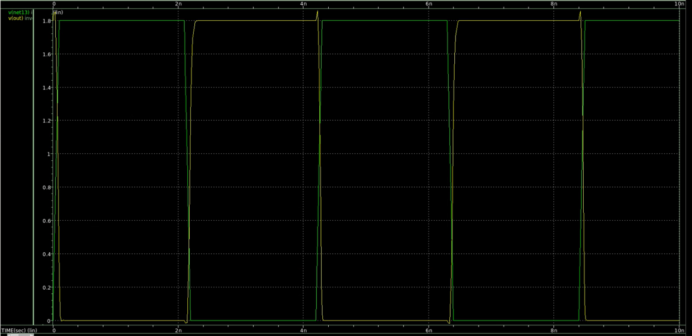
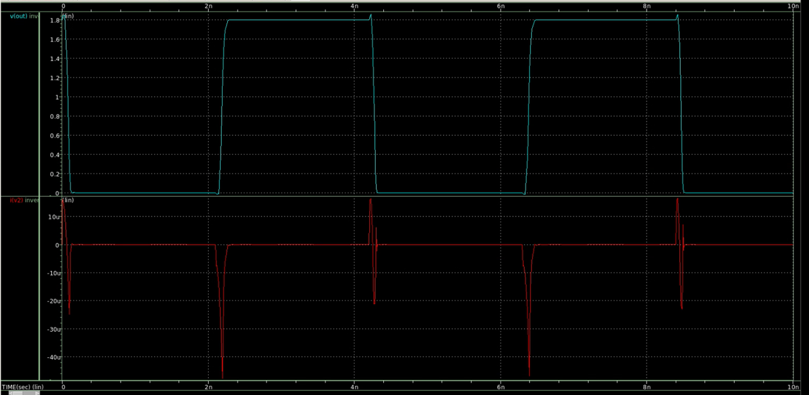
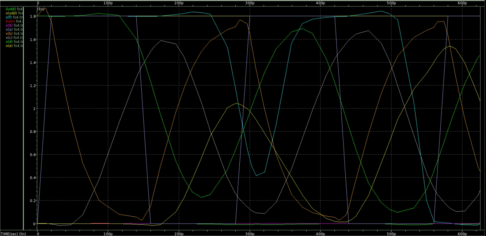
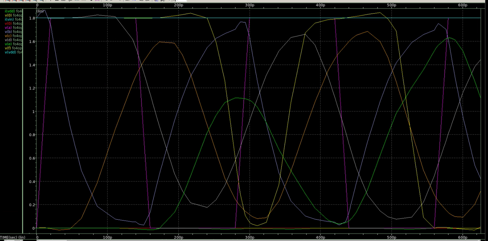

# Tarea1_vlsi
## Parte 1
## Solución
### NMOS - Curva característica
Para las curvas características del NMOS se genera el diagrama de la siguente manera:



Para poder variar los valores de las fuentes v4 y v5 se utiliza el siguiente código:
```sp
* nmos.sp

.temp 25
.lib '/mnt/vol_NFS_rh003/Est_VLSI_I_2024/Faerron_Duran_I_2024_vlsi/tutorial/Hspice/lp5mos/xt018.lib' tm
.lib '/mnt/vol_NFS_rh003/Est_VLSI_I_2024/Faerron_Duran_I_2024_vlsi/tutorial/Hspice/lp5mos/param.lib' 3s
.lib '/mnt/vol_NFS_rh003/Est_VLSI_I_2024/Faerron_Duran_I_2024_vlsi/tutorial/Hspice/lp5mos/config.lib' default


.global gnd
.option post
********************************************************************************
* Library          : basic_cells
* Cell             : nmos
* View             : schematic
* View Search List : hspice hspiceD schematic cmos_sh spice veriloga
* View Stop List   : hspice hspiceD
********************************************************************************
xm0 vds vgs gnd vds ne w=220n l=180n
v5 vds gnd 0
v4 vgs gnd 0

*----------------------------------------------------------------------
* Stimulus
*----------------------------------------------------------------------
.dc v5 0 1.0 0.05 SWEEP v4 0 1.0 0.2
.print v(vds) v(vgs) i(v5)
.probe v(vds) v(vgs)

.end
```
Una vez con la simulación se obtienen los datos para la curva característica, la cual se muestra en la siguiente figura:



## Inversor
El esquemático utilizado para el inversor se muestra en la siguiente figura:



Para simular el voltaje de salida y entrada se utliza el siguiente código:
```
*  inversor_test.sp

.temp 25
.lib '/mnt/vol_NFS_rh003/Est_VLSI_I_2024/Faerron_Duran_I_2024_vlsi/tutorial/Hspice/lp5mos/xt018.lib' tm
.lib '/mnt/vol_NFS_rh003/Est_VLSI_I_2024/Faerron_Duran_I_2024_vlsi/tutorial/Hspice/lp5mos/param.lib' 3s
.lib '/mnt/vol_NFS_rh003/Est_VLSI_I_2024/Faerron_Duran_I_2024_vlsi/tutorial/Hspice/lp5mos/config.lib' default

.global gnd
.option post
********************************************************************************
* Library          : basic_cells
* Cell             : inversor
* View             : schematic
* View Search List : hspice hspiceD schematic cmos_sch spice veriloga
* View Stop List   : hspice hspiceD
********************************************************************************
xm0 out net13 gnd gnd ne w=220n l=180n as=1.056e-13 ad=1.056e-13 ps=1.4e-06 pd=1.4e-06
+ nrs=1.22727 nrd=1.22727 m='1*1' par1='1*1' xf_subext=0
xm1 out net13 net9 net9 pe w=440n l=180n as=2.112e-13 ad=2.112e-13 ps=1.84e-06
+ pd=1.84e-06 nrs=0.613636 nrd=0.613636 m='1*1' par1='1*1' xf_subext=0
v2 net9 gnd dc=1.8
v7 net13 gnd dc=0 pulse ( 0 1.8 0 100p 100p 2n 4.2n )


*--------------------------------------------------------------
* Stimulus
*--------------------------------------------------------------
.tran 10p 10n
.probe v(out) v(net13)
.print v(out) v(net13)

.end
```
Este código da como resultado gráficamente el voltaje de salida (V(out)) y entrada (V(net13)) como se muestra en la siguiente figura:



Y también se puede obtener las gráficas con el valor de la corriente Ids(i(v2)) y la tensión de salida v(out) como se muestra en la siguiente:



## Fanout of 4 (Fo4) - Inversor
Para esta sección se utiliza el siguiente código para crear subcircuitos del inversor:
```
* fo4.sp
*----------------------------------------------------------------------
* Parameters and models
*----------------------------------------------------------------------
.param SUPPLY=1.8
.lib '/mnt/vol_NFS_rh003/Est_VLSI_I_2024/Faerron_Duran_I_2024_vlsi/tutorial/Hspice/lp5mos/xt018.lib' tm
.lib '/mnt/vol_NFS_rh003/Est_VLSI_I_2024/Faerron_Duran_I_2024_vlsi/tutorial/Hspice/lp5mos/param.lib' 3s
.lib '/mnt/vol_NFS_rh003/Est_VLSI_I_2024/Faerron_Duran_I_2024_vlsi/tutorial/Hspice/lp5mos/config.lib' default
.param H=4
.option scale=25n
.temp 70
.option post
*----------------------------------------------------------------------
* Subcircuits
*----------------------------------------------------------------------
.global vdd gnd
.subckt inv a y N=8.8 P=17.6
xm0 y a gnd gnd ne W='N' L=7.2
+ AS='N*5' PS='2*N+10' AD='N*5' PD='2*N+10'
xm1 y a vdd vdd pe W='P' L=7.2
+ AS='P*5' PS='2*P+10' AD='P*5' PD='2*P+10'
.ends
*----------------------------------------------------------------------
* Simulation netlist
*----------------------------------------------------------------------
Vdd vdd gnd 'SUPPLY'
Vin a gnd PULSE 0 'SUPPLY'  0ps 20ps 20ps 120ps 280ps
X1 a b inv * shape input waveform
X2 b c inv M='H' * reshape input waveform
X3 c d inv M='H**2' * device under test
X4 d e inv M='H**3' * load
X5 e f inv M='H**4' * load on load
*----------------------------------------------------------------------
* Stimulus
*----------------------------------------------------------------------
.tran 10p 10n
.measure tpdr * rising prop delay
+ TRIG v(c) VAL='SUPPLY/2' FALL=1
+ TARG v(d) VAL='SUPPLY/2' RISE=1
.measure tpdf * falling prop delay
+ TRIG v(c) VAL='SUPPLY/2' RISE=1
+ TARG v(d) VAL='SUPPLY/2' FALL=1
.measure tpd param='(tpdr+tpdf)/2' * average prop delay
.measure trise * rise time
+ TRIG v(d) VAL='0.2*SUPPLY' RISE=1
+ TARG v(d) VAL='0.8*SUPPLY' RISE=1
.measure tfall * fall time
+ TRIG v(d) VAL='0.8*SUPPLY' FALL=1
+ TARG v(d) VAL='0.2*SUPPLY' FALL=1
.end
```
Con estos subcircuitos se obtiene la siguiente gráfica de Fo4 del inversor:

De esta gráfica se obtienen los valores de tpdr, tpdf, tpd, trise, tfall, también junto con los valores de TRIG y TARG los cuáles indican los eventos de activación y objetivo entre los cuales se mide el retraso. Los cuales se muestran en la siguiente tabla:
|Parámetro|Tiempo(ps)|Targ|Trig|
|---|---|---|---|
|tpdr|56.7592|296.1991|239.4399|
|tpdf|59.3732|176.5518|117.1786|
|tpd|58.0662|||
|trise|74.8842|331.3362|256.4520|
|tfall|60.8461|210.2863|149.4412|

## Fo4 optimizado - Inversor
Para obtener la optimización del Fo4 se utiliza el siguiente código:
```
* fo4opt.sp
*----------------------------------------------------------------------
* Parameters and models
*----------------------------------------------------------------------
.param SUPPLY=1.8
.option scale=25n
.lib '/mnt/vol_NFS_rh003/Est_VLSI_I_2024/Faerron_Duran_I_2024_vlsi/tutorial/Hspice/lp5mos/xt018.lib' tm
.lib '/mnt/vol_NFS_rh003/Est_VLSI_I_2024/Faerron_Duran_I_2024_vlsi/tutorial/Hspice/lp5mos/param.lib' 3s
.lib '/mnt/vol_NFS_rh003/Est_VLSI_I_2024/Faerron_Duran_I_2024_vlsi/tutorial/Hspice/lp5mos/config.lib' default
.temp 70
.option post
*----------------------------------------------------------------------
* Subcircuits
*----------------------------------------------------------------------
.global vdd gnd
.subckt inv a y N=8.8 P=17.6
xm0 y a gnd gnd ne W='N' L=7.2
+ AS='N*5' PS='2*N+10' AD='N*5' PD='2*N+10'
xm1 y a vdd vdd pe W='P' L=7.2
+ AS='P*5' PS='2*P+10' AD='P*5' PD='2*P+10'
.ends
*----------------------------------------------------------------------
* Simulation netlist
*----------------------------------------------------------------------
Vdd vdd gnd 'SUPPLY'
Vin a gnd PULSE 0 'SUPPLY' 0ps 20ps 20ps 120ps 280ps
X1 a b inv P='P1' * shape input waveform
X2 b c inv P='P1' M=4 * reshape input waveform
X3 c d inv P='P1' M=16 * device under test
X4 d e inv P='P1' M=64 * load
X5 e f inv P='P1' M=256 * load on load
*----------------------------------------------------------------------
* Optimization setup
*----------------------------------------------------------------------
.param P1=optrange(8,4,16) * search from 4 to 16, guess 8
.model optmod opt itropt=30 * maximum of 30 iterations
.measure bestratio param='P1/4' * compute best P/N ratio
*----------------------------------------------------------------------
* Stimulus
*----------------------------------------------------------------------
.tran 10p 10n SWEEP OPTIMIZE=optrange RESULTS=diff MODEL=optmod
.measure tpdr * rising propagation delay
+ TRIG v(c) VAL='SUPPLY/2' FALL=1 
+ TARG v(d) VAL='SUPPLY/2' RISE=1
.measure tpdf * falling propagation delay
+ TRIG v(c) VAL='SUPPLY/2' RISE=1
+ TARG v(d) VAL='SUPPLY/2' FALL=1 
.measure tpd param='(tpdr+tpdf)/2' goal=0 * average prop delay
.measure diff param='tpdr-tpdf' goal = 0 * diff between delays
.end
```
Con el código anterior se obtiene la siguiente gráfica:

Y en base a estos resultados también se obtienen los siguientes valores ya optimizados:
|Parámetro|Tiempo(ps)|Targ|Trig|
|---|---|---|---|
|tpdr|59.3174|298.8194|239.5020|
|tpdf|57.2955|171.7359|114.4404|
|tpd|58.3064|||

Esto indica una diferencia de 2.0219ps.